# TASK 0: Let's get some images!

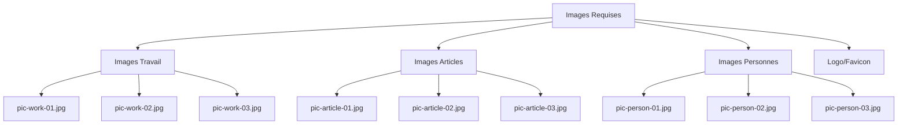

Instructions détaillées:
1. Créer une structure de dossiers:
```bash
mkdir -p holbertonschool-web_front_end/CSS_advanced/images
cd holbertonschool-web_front_end/CSS_advanced/images
```

2. Télécharger depuis unsplash.com:
- 3 images de travail (professionnelles)
- 3 images d'articles 
- 3 images de personnes
- Plus les logos et favicon du projet

# TASK 1: Effortless transitions when scrolling

```css
/* styles/1-style.css */
html {
    scroll-behavior: smooth;
}
```

# TASK 2: Do you know your color values?

```css
/* styles/2-style.css */
body {
    color: #161616;
}

a {
    color: #161616;
}

.visually-hidden {
    display: none;
}

.card-category {
    color: #D73953;
}

.section-tagline {
    color: #D73953;
}
```
# TASK 3: Variables CSS

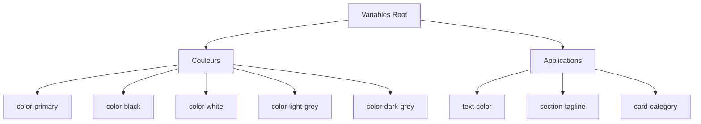

```css
/* styles/3-style.css */
:root {
    --color-primary: #d73953;
    --color-black: #090909;
    --color-white: #ffffff;
    --color-light-grey: #f3f3f3;
    --color-dark-grey: #353535;
    --text-color: var(--color-black);
}

body {
    color: var(--text-color);
}

a {
    color: var(--text-color);
}

.section-tagline {
    color: var(--color-primary);
}

.card-category {
    color: var(--color-primary);
}
```

# TASK 4: Font Variables

```css
/* styles/4-style.css */
:root {
    /* Previous variables */
    --font-family-base: 'Helvetica Neue', Helvetica, Arial, sans-serif;
    --font-family-title: 'Helvetica Neue', Helvetica, Arial, sans-serif;
}

body {
    font-family: var(--font-family-base);
}

h1, h2, h3, h4, h5, h6 {
    font-family: var(--font-family-title);
}
```

# TASK 5: Font Size Variables

```css
/* styles/5-style.css */
:root {
    /* Previous variables */
    --font-size-small: 1.2rem;
    --font-size-medium: 1.6rem;
    --font-size-large: 1.8rem;
    --font-size-x-large: 2.3rem;
    --font-size-xx-large: 4.8rem;
}

html {
    font-size: 62.5%;
}

body {
    font-size: var(--font-size-medium);
}
```

Structure visuelle pour les tâches 3-5:

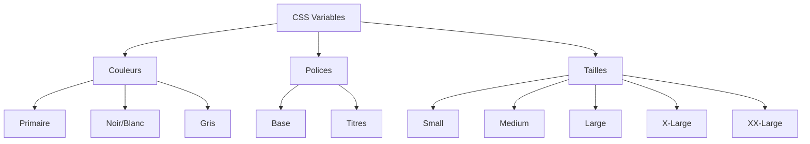

Points de vérification:
1. Variables root définies correctement
2. Application cohérente des variables
3. Héritage correct des propriétés
4. Organisation logique du code
5. Nommage clair des variables

# TASK 6: Font Weight Variables

**Question**: Comment implémenter et gérer les poids de police dans le CSS ?

**Réponse détaillée**:

1. **Configuration des variables**:
```css
:root {
    --font-weight-regular: 400;
    --font-weight-bold: 700;
}
```

**Pourquoi ces valeurs ?**
- 400 : Poids standard pour le texte normal
- 700 : Poids standard pour le texte en gras

2. **Application dans le document**:
```css
body {
    font-weight: var(--font-weight-regular);
}

h1, h2, h3, h4, h5, h6 {
    font-weight: var(--font-weight-bold);
}
```

**Explication**:
- Le body utilise le poids regular (400) pour une meilleure lisibilité du texte général
- Les titres utilisent le poids bold (700) pour se démarquer visuellement

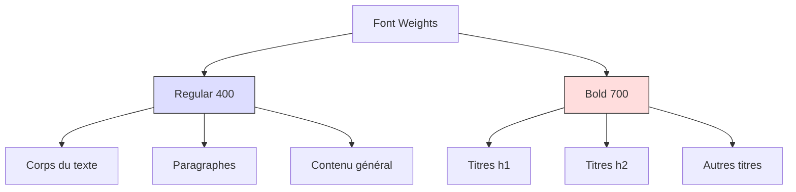

**Points de vérification**:
1. ✓ Variables définies au niveau racine
2. ✓ Poids régulier appliqué au corps
3. ✓ Poids gras appliqué aux titres
4. ✓ Syntaxe CSS correcte
5. ✓ Réutilisabilité des variables

**Conseils pratiques**:
- Toujours utiliser les variables pour la cohérence
- Ne pas multiplier les poids différents
- Maintenir la hiérarchie visuelle
- Penser à l'accessibilité du texte

**Questions supplémentaires**:
1. Pourquoi utiliser des variables plutôt que des valeurs directes ?
   - Pour la maintenance
   - Pour la cohérence
   - Pour les modifications faciles

2. Pourquoi ces poids spécifiques ?
   - 400 : Standard de l'industrie pour le texte normal
   - 700 : Standard pour le gras, bon contraste avec 400

# TASK 7: Integrating Google Fonts

**Question**: Comment intégrer et utiliser les polices Google Fonts Open Sans et Raleway dans notre CSS ?

**Réponse détaillée**:

1. **Modification des variables de police**:
```css
:root {
    --font-family-base: 'Open Sans', 'Helvetica Neue', Helvetica, Arial, sans-serif;
    --font-family-title: 'Raleway', 'Helvetica Neue', Helvetica, Arial, sans-serif;
}
```

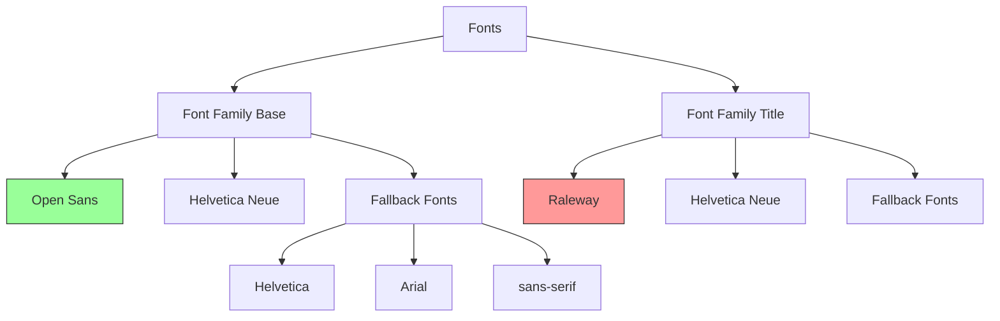

**Explication des modifications**:

1. **Font-family-base**:
   - Police principale : Open Sans
   - Pourquoi ? Excellente lisibilité pour le texte courant
   - Fallback en ordre de priorité

2. **Font-family-title**:
   - Police principale : Raleway
   - Pourquoi ? Design moderne pour les titres
   - Même chaîne de fallback que la base

**Points de vérification**:
1. ✓ Open Sans en première position pour font-family-base
2. ✓ Raleway en première position pour font-family-title
3. ✓ Chaîne de fallback complète
4. ✓ Variables correctement définies
5. ✓ Syntaxe CSS valide

**Structure du code complète**:
```css
/* styles/7-style.css */
:root {
    /* Précédentes variables conservées */
    --color-primary: #d73953;
    --color-black: #090909;
    --color-white: #ffffff;
    --color-light-grey: #f3f3f3;
    --color-dark-grey: #353535;
    --text-color: var(--color-black);
    
    /* Font Weights */
    --font-weight-regular: 400;
    --font-weight-bold: 700;

    /* Nouvelles définitions de polices */
    --font-family-base: 'Open Sans', 'Helvetica Neue', Helvetica, Arial, sans-serif;
    --font-family-title: 'Raleway', 'Helvetica Neue', Helvetica, Arial, sans-serif;
}

/* Applications restent inchangées */
body {
    font-family: var(--font-family-base);
    font-weight: var(--font-weight-regular);
    color: var(--text-color);
}

h1, h2, h3, h4, h5, h6 {
    font-family: var(--font-family-title);
    font-weight: var(--font-weight-bold);
}
```

**Conseils pratiques**:
- Toujours inclure une chaîne de fallback complète
- Tester le rendu avec les polices de fallback
- Vérifier les performances de chargement des polices
- Considérer le préchargement des polices pour les performances

**Pourquoi cette approche ?**
1. Meilleure maintenabilité
2. Cohérence visuelle
3. Plan de secours robuste
4. Flexibilité pour les changements futurs

# TASK 8: Defining Line Heights

**Question**: Comment définir et appliquer correctement les hauteurs de ligne dans notre projet ?

**Réponse détaillée**:

```css
:root {
    /* Précédentes variables conservées */
    
    /* Nouvelles variables de line-height */
    --line-height-small: 1.2;
    --line-height-base: 1.5;
    --line-height-big: 1.8;
}

body {
    /* Styles précédents conservés */
    line-height: var(--line-height-base);
}
```

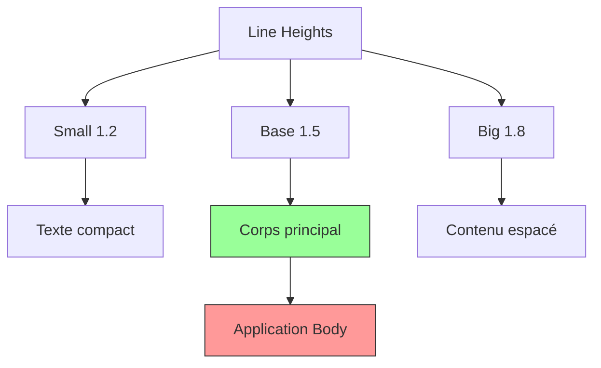

**Explication des valeurs**:
1. `--line-height-small: 1.2`
   - Pour texte compact
   - Idéal pour les titres
   - Minimise l'espace vertical

2. `--line-height-base: 1.5`
   - Standard pour le texte principal
   - Optimise la lisibilité
   - Recommandé pour le corps du texte

3. `--line-height-big: 1.8`
   - Pour un espacement plus aéré
   - Améliore la lisibilité des longs paragraphes
   - Utilisé pour le contenu qui nécessite plus d'espace

**Points de vérification**:
1. ✓ Variables définies dans :root
2. ✓ Application au body
3. ✓ Valeurs sans unité
4. ✓ Maintien des styles précédents
5. ✓ Pas de validation W3C requise

**Conseils d'utilisation**:
```css
/* Exemple d'utilisation avancée */
.text-dense {
    line-height: var(--line-height-small);
}

.text-normal {
    line-height: var(--line-height-base);
}

.text-spaced {
    line-height: var(--line-height-big);
}
```

**Pourquoi ces valeurs ?**
- 1.2 : Minimum recommandé pour la lisibilité
- 1.5 : Standard web pour le texte courant
- 1.8 : Optimal pour le contenu nécessitant plus d'espace

**Impact sur l'accessibilité**:
- Meilleure lisibilité
- Plus facile à scanner visuellement
- Aide les lecteurs dyslexiques

# TASK 9: Links Decoration

**Question**: Comment gérer le style des liens sans décoration ?

**Réponse détaillée**:

```css
a {
    text-decoration: none;
}
```

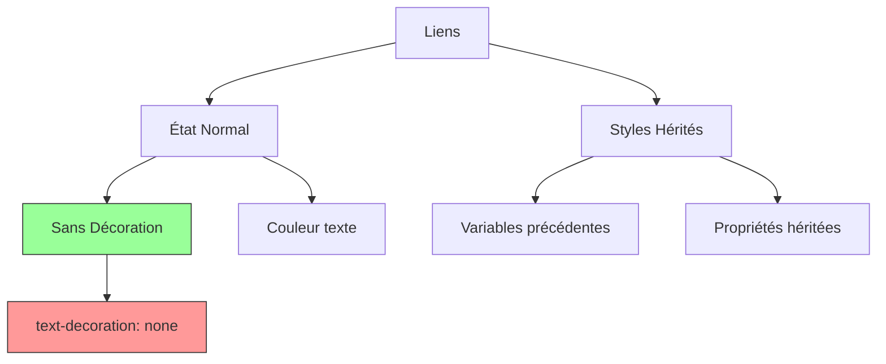

# TASK 10: Center Section Titles 

**Question**: Comment centrer les titres de section et créer une variable pour l'alignement ?

```css
:root {
    /* Variables précédentes */
    --section-header-align: center;
}

.section-header {
    text-align: var(--section-header-align);
}
```

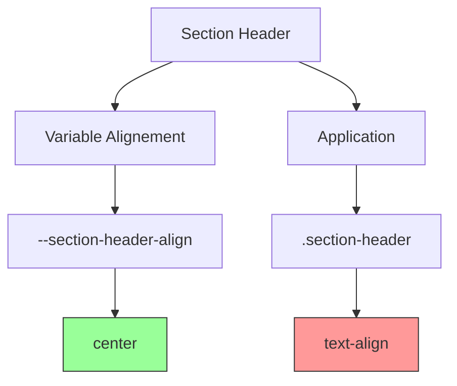

**Points de vérification pour les deux tâches**:

1. Task 9:
   - ✓ Suppression de toute décoration sur les liens
   - ✓ Conservation des autres propriétés des liens
   - ✓ Style appliqué globalement

2. Task 10:
   - ✓ Variable d'alignement définie dans :root
   - ✓ Application correcte à .section-header
   - ✓ Centrage effectif des titres

**Structure complète du code**:
```css
/* Conservation des styles précédents */
:root {
    /* Toutes les variables précédentes */
    --section-header-align: center;
}

/* Style des liens */
a {
    color: var(--text-color);
    text-decoration: none;
}

/* Alignement des headers de section */
.section-header {
    text-align: var(--section-header-align);
}
```

**Pourquoi ces choix ?**:
1. Liens sans décoration :
   - Plus moderne
   - Plus propre visuellement
   - Meilleur contrôle du style

2. Centrage des titres :
   - Variable pour flexibilité
   - Application uniforme
   - Maintenance facilitée

**Best Practices**:
- Utilisation de variables CSS
- Styles modulaires
- Code maintenant propre
- Flexibilité pour changements futurs

# TASK 11: Section Tagline Styles

**Question**: Comment styler la classe section-tagline avec transformation de texte et variables appropriées ?

**Réponse détaillée**:

```css
:root {
    /* Variables précédentes */
    --section-tagline-transform: uppercase;
}

.section-tagline {
    font-family: var(--font-family-title);
    text-transform: var(--section-tagline-transform);
    font-weight: var(--font-weight-bold);
}
```

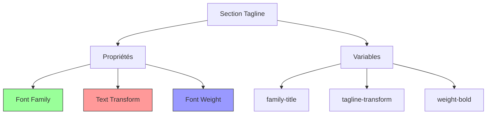

# TASK 12: Section Title Styling

**Question**: Comment configurer le style des titres de section avec les marges et couleurs appropriées ?

```css
:root {
    /* Variables précédentes */
    --section-title-margin: 0;
    --section-title-color: var(--color-black);
}

.section-title {
    font-family: var(--font-family-title);
    font-size: var(--font-size-xx-large);
    font-weight: var(--font-weight-bold);
    margin: var(--section-title-margin);
    color: var(--section-title-color);
}
```

**Points de vérification**:

1. Task 11:
   - ✓ Variable de transformation définie
   - ✓ Police de titre appliquée
   - ✓ Texte en majuscules
   - ✓ Poids de police en gras
   - ✓ Utilisation cohérente des variables

2. Task 12:
   - ✓ Variables de marge et couleur définies
   - ✓ Taille de police correcte
   - ✓ Famille de police appropriée
   - ✓ Couleur du texte définie
   - ✓ Marges configurées

**Structure complète**:
```css
/* Toutes les variables root */
:root {
    /* Variables précédentes maintenues */
    --section-tagline-transform: uppercase;
    --section-title-margin: 0;
    --section-title-color: var(--color-black);
}

/* Styles section-tagline */
.section-tagline {
    font-family: var(--font-family-title);
    text-transform: var(--section-tagline-transform);
    font-weight: var(--font-weight-bold);
}

/* Styles section-title */
.section-title {
    font-family: var(--font-family-title);
    font-size: var(--font-size-xx-large);
    font-weight: var(--font-weight-bold);
    margin: var(--section-title-margin);
    color: var(--section-title-color);
}
```

**Pourquoi ces choix ?**:
- Variables réutilisables
- Cohérence du design
- Maintenance facilitée
- Flexibilité des styles

# TASK 13: Pseudo Classes

**Question**: Comment implémenter les états différents des liens avec les pseudo-classes ?

**Réponse détaillée**:

```css
a:link {
    color: var(--text-color);
}

a:visited {
    font-style: italic;
}

a:hover {
    text-decoration: underline;
}

a:active {
    background-color: var(--color-light-grey);
}
```

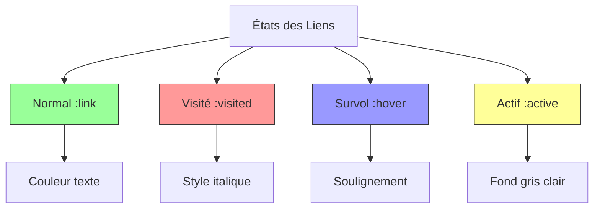

# TASK 14: Normalize CSS

**Question**: Comment normaliser le CSS pour une meilleure compatibilité entre navigateurs ?

```css
/* Importer normalize.css avant nos styles */
@import 'normalize.css';

/* Reste du code précédent */
```

**Points de vérification**:

1. Task 13 (Pseudo-classes):
   - ✓ État normal défini
   - ✓ État visité avec italique
   - ✓ Survol avec soulignement
   - ✓ État actif avec fond coloré
   - ✓ Utilisation des variables CSS

2. Task 14 (Normalize):
   - ✓ Import de normalize.css
   - ✓ Placement en début de fichier
   - ✓ Maintien des styles existants
   - ✓ Pas de conflits avec nos styles

**Structure recommandée du fichier**:
```css
/* styles/14-style.css */

/* 1. Normalize CSS */
@import 'normalize.css';

/* 2. Variables */
:root {
    /* Toutes nos variables précédentes */
}

/* 3. Styles de base */
body {
    /* Styles existants */
}

/* 4. Styles des liens */
a:link {
    color: var(--text-color);
}

a:visited {
    font-style: italic;
}

a:hover {
    text-decoration: underline;
}

a:active {
    background-color: var(--color-light-grey);
}

/* 5. Autres styles existants */
/* ... */
```

**Pourquoi utiliser normalize.css ?**:
1. Consistance entre navigateurs
2. Base solide pour le styling
3. Correction des bugs courants
4. Meilleure compatibilité

**Points importants**:
- Ordre d'importation crucial
- Respect des styles normalisés
- Conservation de nos personnalisations
- Test cross-browser nécessaire

# TASK 15: Universal Box-sizing

**Question**: Comment appliquer un box-sizing universel pour une meilleure gestion des dimensions ?

**Réponse détaillée**:

```css
/* Ajout avant les styles html */
*, *:before, *:after {
    box-sizing: border-box;
}
```

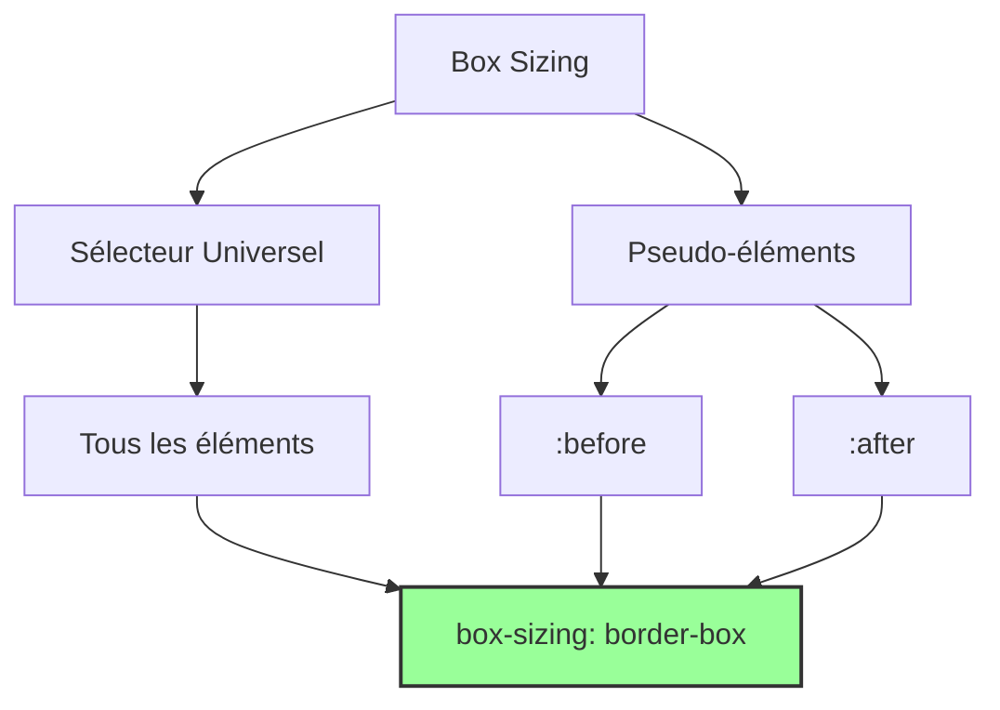

# TASK 16: Container Styling

**Question**: Comment styler le container avec une largeur fixe et des marges automatiques ?

```css
.container {
    width: 960px;
    margin-left: auto;
    margin-right: auto;
}
```

**Structure combinée**:
```css
/* styles/16-style.css */

/* 1. Normalize CSS */
@import 'normalize.css';

/* 2. Box Sizing Universel */
*, *:before, *:after {
    box-sizing: border-box;
}

/* 3. Variables Root */
:root {
    /* Variables précédentes maintenues */
}

/* 4. Styles de base */
/* Styles précédents maintenus */

/* 5. Container */
.container {
    width: 960px;
    margin-left: auto;
    margin-right: auto;
}
```

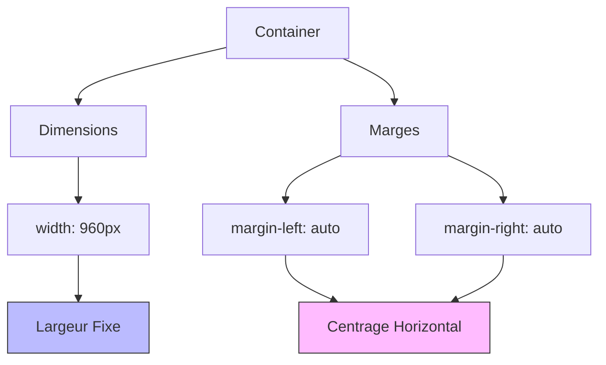

**Points de vérification**:

1. Box Sizing (Task 15):
   - ✓ Sélecteur universel utilisé
   - ✓ Pseudo-éléments inclus
   - ✓ box-sizing: border-box appliqué
   - ✓ Placement avant autres styles

2. Container (Task 16):
   - ✓ Largeur fixe définie
   - ✓ Marges automatiques
   - ✓ Centrage horizontal
   - ✓ Structure maintenue

**Pourquoi ces choix ?**:

Box Sizing:
- Calcul de dimensions plus intuitif
- Gestion plus simple des padding
- Évite les débordements inattendus
- Meilleure prévisibilité du layout

Container:
- Largeur contrôlée
- Centrage automatique
- Design responsive préparé
- Structure cohérente

# TASK 17: Section Padding

**Question**: Comment implémenter le padding des sections avec des variables CSS personnalisées ?

**Réponse détaillée**:

```css
:root {
    /* Variables précédentes */
    --section-padding: 5rem 0;
    --section-header-padding: 0 0 3rem;
    --section-body-padding: 0 0 3rem;
    --section-footer-padding: 3rem 0 0;
    --section-footer-align: center;
    --footer-padding: 5rem 0 1rem;
}

.section {
    padding: var(--section-padding);
}

.section-header {
    padding: var(--section-header-padding);
}

.section-body {
    padding: var(--section-body-padding);
}

.section-footer {
    padding: var(--section-footer-padding);
    text-align: var(--section-footer-align);
}

.footer {
    padding: var(--footer-padding);
}
```

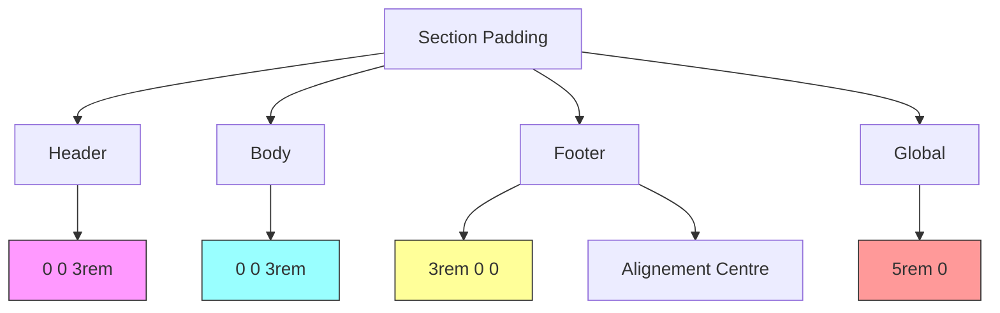

**Points de vérification**:

1. Variables:
   - ✓ Toutes les variables de padding définies
   - ✓ Valeurs en rem pour la flexibilité
   - ✓ Alignement footer défini
   - ✓ Namespace cohérent

2. Application:
   - ✓ Section globale
   - ✓ En-tête de section
   - ✓ Corps de section
   - ✓ Pied de section
   - ✓ Footer global

**Structure complète**:
```css
/* 1. Variables */
:root {
    /* Variables précédentes */
    --section-padding: 5rem 0;
    --section-header-padding: 0 0 3rem;
    --section-body-padding: 0 0 3rem;
    --section-footer-padding: 3rem 0 0;
    --section-footer-align: center;
    --footer-padding: 5rem 0 1rem;
}

/* 2. Sections Styling */
.section {
    padding: var(--section-padding);
}

.section-header {
    padding: var(--section-header-padding);
}

.section-body {
    padding: var(--section-body-padding);
}

.section-footer {
    padding: var(--section-footer-padding);
    text-align: var(--section-footer-align);
}

/* 3. Footer Global */
.footer {
    padding: var(--footer-padding);
}
```

**Explications des valeurs**:
1. `5rem 0`:
   - Espacement vertical important
   - Pas d'espacement horizontal

2. `0 0 3rem`:
   - Espacement uniquement en bas
   - Maintien de la hiérarchie visuelle

3. `3rem 0 0`:
   - Espacement uniquement en haut
   - Séparation claire des sections

**Avantages de cette approche**:
- Maintenance facilitée
- Cohérence du design
- Flexibilité des ajustements
- Structure claire et organisée

# TASK 18: Customizing the Navbar

**Question**: Comment créer et personnaliser une barre de navigation responsive et bien structurée ?

**Réponse détaillée**:

```css
/* 1. Définition des variables */
:root {
    /* Variables précédentes */
    --nav-item-font-family: var(--font-family-title);
    --nav-item-font-weight: var(--font-weight-bold);
    --nav-item-font-size: var(--font-size-medium);
    --nav-item-letter-spacing: 0.04rem;
    --nav-item-display: inline-block;
    --nav-item-margin: 0 0 3rem 0;
    --nav-item-link-hover: var(--color-primary);
}

/* 2. Styles de navigation */
.navbar-menu {
    float: right;
}

.nav {
    margin: 0;
    padding: 0;
    list-style: none;
    text-align: center;
}

.nav .nav-item {
    font-family: var(--nav-item-font-family);
    font-weight: var(--nav-item-font-weight);
    font-size: var(--nav-item-font-size);
    letter-spacing: var(--nav-item-letter-spacing);
    display: var(--nav-item-display);
    margin: var(--nav-item-margin);
}

.nav .nav-link {
    display: block;
    padding: 0.5rem 1rem;
}

.nav .nav-link:hover {
    color: var(--nav-item-link-hover);
}
```

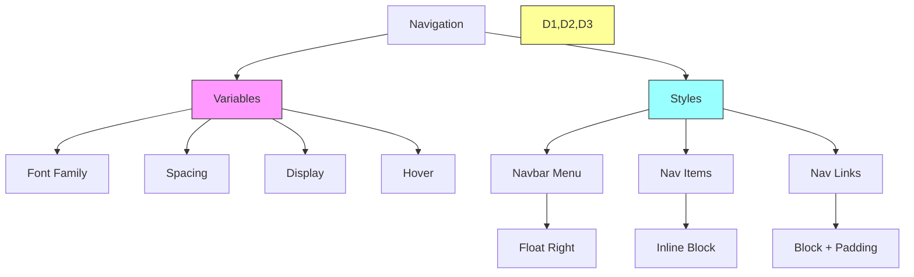

**Points de vérification**:

1. Variables de Navigation:
   - ✓ Police spécifique définie
   - ✓ Espacement des lettres
   - ✓ Marges et padding
   - ✓ État de survol

2. Structure:
   - ✓ Menu flottant à droite
   - ✓ Liste sans style
   - ✓ Alignement centré
   - ✓ Affichage en ligne

3. Interactions:
   - ✓ Effet de survol
   - ✓ Padding des liens
   - ✓ Espacement correct

**Explications des propriétés clés**:

```css
/* Exemple détaillé de chaque propriété */

/* 1. Float right pour alignement */
.navbar-menu {
    float: right; /* Aligne le menu à droite */
}

/* 2. Reset de la liste */
.nav {
    margin: 0;
    padding: 0;
    list-style: none; /* Supprime les puces */
    text-align: center;
}

/* 3. Style des éléments */
.nav .nav-item {
    display: inline-block; /* Alignement horizontal */
    /* Autres styles typographiques */
}

/* 4. Style des liens */
.nav .nav-link {
    display: block;
    padding: 0.5rem 1rem; /* Espace cliquable */
}
```

**Pourquoi ces choix ?**:

1. Flottement à droite:
   - Design moderne
   - Meilleure utilisation de l'espace
   - Standard des sites web

2. Inline-block:
   - Flexibilité de mise en page
   - Maintient l'alignement horizontal
   - Permet padding/margin

3. Block pour les liens:
   - Zone cliquable plus grande
   - Meilleure accessibilité
   - UX améliorée

# TASK 19: Grid Styling et Variables Personnalisées

**Question**: Comment créer un système de grille flexible avec des variables CSS ?

**Réponse détaillée**:

```css
:root {
    /* Variables précédentes */
    --section-tagline-margin: 0;
}

/* 1. Style Section Tagline */
.section-tagline {
    margin: var(--section-tagline-margin);
}

/* 2. Styles de Grille */
.row ul {
    margin: 0;
    padding: 0;
    list-style: none;
}

/* 3. Classes de colonnes */
.col-1-3 {
    width: 33.33%;
    float: left;
    padding: 0.5rem;
}

.col-1-2 {
    width: 50%;
    float: left;
    padding: 0.5rem;
}
```

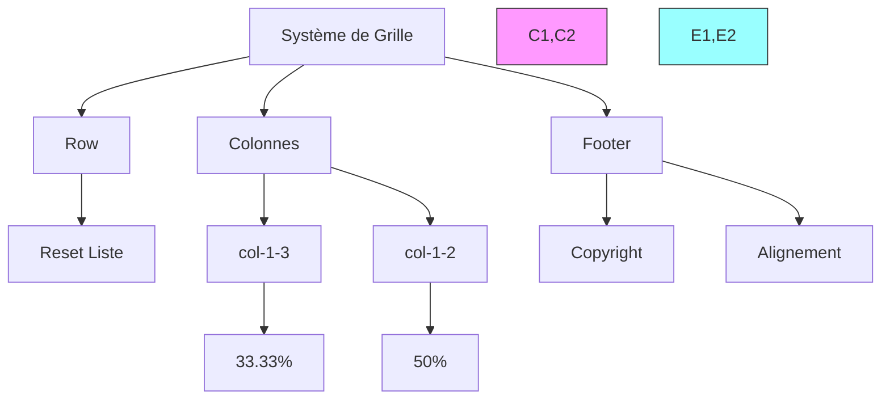

**Points de vérification**:

1. Variables et Marges:
   - ✓ Section tagline margin définie
   - ✓ Application correcte
   - ✓ Reset des listes

2. Colonnes:
   - ✓ Largeurs proportionnelles
   - ✓ Flottement gauche
   - ✓ Padding uniforme

3. Footer:
   - ✓ Style copyright
   - ✓ Alignement texte
   - ✓ Taille police

**Structure complète du code**:
```css
/* 1. Variables */
:root {
    --section-tagline-margin: 0;
}

/* 2. Styles de base */
.section-tagline {
    margin: var(--section-tagline-margin);
}

/* 3. Reset des listes dans les rows */
.row ul {
    margin: 0;
    padding: 0;
    list-style: none;
}

/* 4. Colonnes */
.col-1-3 {
    width: 33.33%;
    float: left;
    padding: 0.5rem;
}

.col-1-2 {
    width: 50%;
    float: left;
    padding: 0.5rem;
}

/* 5. Footer styling */
.footer-copyright {
    margin: 0;
    font-size: var(--font-size-small);
    color: var(--text-color);
}

.footer ul {
    text-align: right;
}
```

**Explications des choix**:

1. **Système de grille**:
   - Utilisation de pourcentages pour flexibilité
   - Padding uniforme pour espacement
   - Float pour alignement

2. **Reset des listes**:
   - Suppression des marges par défaut
   - Élimination des puces
   - Meilleur contrôle du layout

3. **Copyright footer**:
   - Taille de police réduite
   - Suppression des marges
   - Couleur cohérente

**Avantages de cette approche**:
- Système de grille flexible
- Facilement maintenable
- Réutilisable
- Responsive-ready

# TASK 20: Clear the Grid Context

**Question**: Comment gérer le contexte de flottement dans notre système de grille ?

**Réponse détaillée**:

```css
/* Clear fix pour les rows */
.row::after {
    content: "";
    display: table;
    clear: both;
}
```

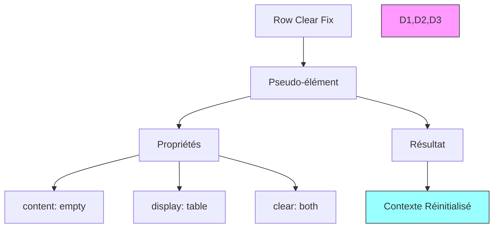

# TASK 21: Simplifier les Sélecteurs Col-

**Question**: Comment optimiser les sélecteurs de colonnes avec une approche plus générique ?

```css
/* Ancien code */
.col-1-3, .col-1-2 {
    float: left;
    padding: 0.5rem;
}

/* Nouveau code plus générique */
[class^="col-"] {
    float: left;
    padding: 0.5rem;
}

/* Garder uniquement les largeurs spécifiques */
.col-1-3 {
    width: 33.33%;
}

.col-1-2 {
    width: 50%;
}
```

**Points de vérification**:

1. Clearfix:
   - ✓ Pseudo-élément ::after utilisé
   - ✓ Clear both appliqué
   - ✓ Display table configuré
   - ✓ Contenu vide défini

2. Sélecteurs optimisés:
   - ✓ Sélecteur d'attribut utilisé
   - ✓ Propriétés communes regroupées
   - ✓ Spécificité maintenue
   - ✓ Code DRY (Don't Repeat Yourself)

**Structure complète du code**:
```css
/* 1. Clear fix pour les rows */
.row::after {
    content: "";
    display: table;
    clear: both;
}

/* 2. Styles communs pour toutes les colonnes */
[class^="col-"] {
    float: left;
    padding: 0.5rem;
}

/* 3. Largeurs spécifiques */
.col-1-3 {
    width: 33.33%;
}

.col-1-2 {
    width: 50%;
}
```

**Explications détaillées**:

1. **Clearfix (`row::after`)**:
   - `content: ""` : Crée un contenu vide
   - `display: table` : Assure un comportement de bloc
   - `clear: both` : Nettoie les flottements

2. **Sélecteur optimisé (`[class^="col-"]`)**:
   - Cible toutes les classes commençant par "col-"
   - Regroupe les propriétés communes
   - Réduit la répétition de code

**Avantages de cette approche**:

1. **Maintenance**:
   - Code plus propre
   - Moins de répétitions
   - Plus facile à mettre à jour

2. **Performance**:
   - Moins de CSS
   - Meilleure organisation
   - Plus facile à déboguer

3. **Extensibilité**:
   - Facile d'ajouter de nouvelles colonnes
   - Structure cohérente
   - Pattern réutilisable

# TASK 22: Dark Theme pour les Sections

**Question**: Comment implémenter un thème sombre pour certaines sections en utilisant les attributs data ?

**Réponse détaillée**:

```css
/* Style pour les sections avec thème sombre */
[data-section-theme="dark"] {
    --text-color: var(--color-white);
    --section-title-color: var(--color-white);
    background-color: var(--color-black);
}
```

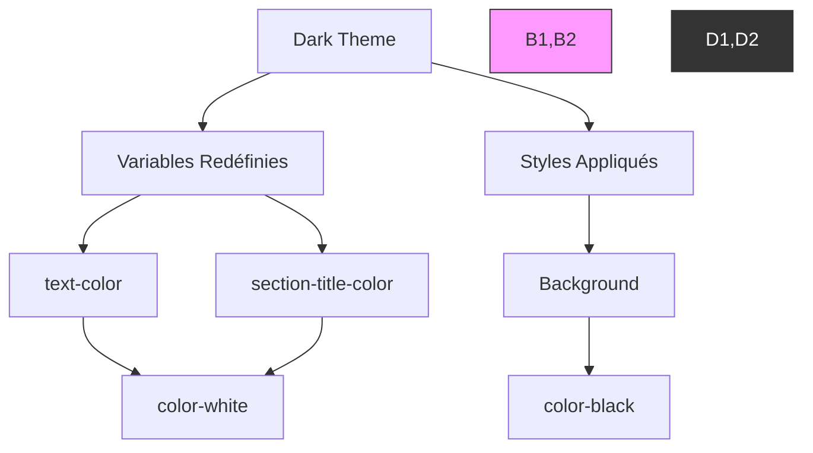

# TASK 23: Corrections pour le Thème Sombre

**Question**: Comment adapter les éléments spécifiques dans le thème sombre ?

```css
/* Styles pour l'adresse dans le footer */
.footer-address {
    color: var(--text-color);
}

/* Styles pour les liens sociaux */
.social-link {
    display: block;
}

/* SVG dans les liens sociaux */
.social-link > svg {
    fill: var(--text-color);
}
```

**Points de vérification**:

1. Thème Sombre:
   - ✓ Variables redéfinies correctement
   - ✓ Background appliqué
   - ✓ Texte contrasté

2. Adaptations Spécifiques:
   - ✓ Adresse footer stylée
   - ✓ Liens sociaux configurés
   - ✓ SVG colorés appropriés

**Structure complète**:
```css
/* 1. Configuration du thème sombre */
[data-section-theme="dark"] {
    --text-color: var(--color-white);
    --section-title-color: var(--color-white);
    background-color: var(--color-black);
}

/* 2. Styles pour l'adresse */
.footer-address {
    color: var(--text-color);
}

/* 3. Configuration des liens sociaux */
.social-link {
    display: block;
}

/* 4. Style des icônes SVG */
.social-link > svg {
    fill: var(--text-color);
}
```

**Explications des choix**:

1. **Variables du thème**:
   - Utilisation de `data-section-theme`
   - Redéfinition contextuelle des couleurs
   - Maintien de la cohérence visuelle

2. **Adaptations spécifiques**:
   - Display block pour meilleur contrôle
   - Remplissage SVG adaptatif
   - Couleur de texte dynamique

**Avantages**:
- Thème cohérent
- Maintenance facilitée
- Accessibilité préservée
- Flexibilité du design

# TASK 24: Personnalisation des Services avec Background et États de Survol

**Question**: Comment personnaliser les cartes de services avec leurs états et effets ?

```css
/* 1. Reset du titre de la carte */
.card-services .card-title {
    margin: 0;
}

/* 2. Style des liens dans les services */
.card-services a {
    display: block;
    padding: 2rem;
    background-color: var(--color-light-grey);
}

/* 3. État de survol */
.card-services a:hover {
    color: var(--color-white);
    background-color: var(--color-primary);
    text-decoration: none;
}
```

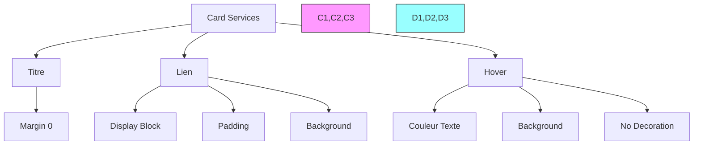

# TASK 25: Ajout de Bordures aux Boutons

**Question**: Comment créer et styliser des boutons avec des bordures personnalisées ?

```css
:root {
    /* Variables des boutons */
    --button-display: inline-block;
    --button-padding: 1.5rem 3rem;
    --button-border: 0.2rem solid var(--color-primary);
    --button-color: var(--color-black);
    --button-text-decoration: none;
    --button-font-size: var(--font-size-large);
    --button-hover-color: var(--color-white);
    --button-hover-text-decoration: none;
    --button-hover-background: var(--color-primary);
}

/* Style des boutons */
.button {
    display: var(--button-display);
    padding: var(--button-padding);
    border: var(--button-border);
    font-size: var(--button-font-size);
    color: var(--button-color);
    text-decoration: var(--button-text-decoration);
}

/* État de survol */
.button:hover {
    color: var(--button-hover-color);
    text-decoration: var(--button-hover-text-decoration);
    background: var(--button-hover-background);
}

/* Thème sombre */
[data-section-theme="dark"] {
    --button-color: var(--color-white);
}
```

**Points de vérification**:

1. Services (Task 24):
   - ✓ Titres sans marge
   - ✓ Liens en bloc avec padding
   - ✓ Effet de survol complet

2. Boutons (Task 25):
   - ✓ Variables définies
   - ✓ Style de base
   - ✓ État de survol
   - ✓ Adaptation thème sombre

**Explications techniques**:

1. **Services** :
```css
/* Exemple détaillé de l'effet de survol */
.card-services a:hover {
    color: var(--color-white);          /* Texte blanc */
    background: var(--color-primary);    /* Fond coloré */
    text-decoration: none;              /* Pas de soulignement */
}
```

2. **Boutons** :
```css
/* Structure détaillée du bouton */
.button {
    display: inline-block;      /* Comportement en ligne mais block */
    padding: 1.5rem 3rem;       /* Espace interne généreux */
    border: 0.2rem solid;       /* Bordure épaisse */
    /* ... autres styles ... */
}
```
# TASK 26: Border Radius pour les Images

**Question**: Comment styliser les avatars et les témoignages avec des images arrondies ?

```css
/* 1. Alignement des témoignages */
.card-testimonial {
    text-align: center;
}

/* 2. Style des avatars */
.card-testimonial .card-avatar {
    border-radius: 50%;
    width: 10rem;
    height: 10rem;
}

/* 3. Style des citations */
.card-testimonial .card-quote cite {
    display: block;
    padding-top: 1rem;
    color: var(--color-primary);
}
```

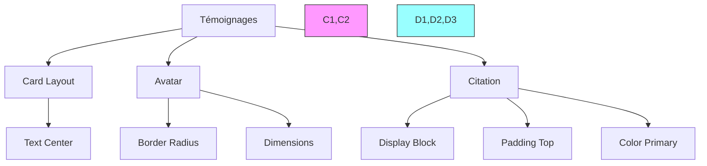

# TASK 27: Styling Section Hero

**Question**: Comment créer une section héro attractive avec des dimensions personnalisées ?

```css
/* 1. Style du fond héro */
.section-hero {
    background-size: 90rem auto;
}

/* 2. Style du titre */
.section-hero .section-title {
    margin-bottom: 5rem;
}

/* 3. Style de l'intérieur */
.section-hero .section-inner {
    padding: 10rem 40rem 2rem 0;
}
```

**Points de vérification**:

1. Témoignages:
   - ✓ Images parfaitement rondes
   - ✓ Dimensions correctes
   - ✓ Citations bien formatées
   - ✓ Alignement centré

2. Section Héro:
   - ✓ Taille de fond appropriée
   - ✓ Marges du titre
   - ✓ Padding intérieur
   - ✓ Structure responsive

**Structure complète**:
```css
/* 1. Card Testimonial */
.card-testimonial {
    text-align: center;
}

.card-testimonial .card-avatar {
    border-radius: 50%;
    width: 10rem;
    height: 10rem;
}

.card-testimonial .card-quote cite {
    display: block;
    padding-top: 1rem;
    color: var(--color-primary);
}

/* 2. Hero Section */
.section-hero {
    background-size: 90rem auto;
}

.section-hero .section-title {
    margin-bottom: 5rem;
}

.section-hero .section-inner {
    padding: 10rem 40rem 2rem 0;
}
```

**Explications techniques**:

1. **Avatars arrondis**:
```css
/* Création d'images parfaitement rondes */
.card-avatar {
    border-radius: 50%;    /* Arrondi complet */
    width: 10rem;          /* Largeur fixe */
    height: 10rem;         /* Hauteur égale pour cercle parfait */
}
```

2. **Section Héro**:
```css
/* Structure du héro */
.section-hero {
    background-size: 90rem auto;  /* Taille de fond contrôlée */
}

.section-inner {
    padding: 10rem 40rem 2rem 0;  /* Espacement asymétrique */
}
```
# TASK 28: Fixing the Header and Menu Navigation Bar

**Question**: Comment structurer et positionner correctement l'en-tête et la navigation ?

```css
:root {
    /* Nouvelles variables pour l'en-tête */
    --header-padding: 4rem 0 0;
    --header-logo-position: relative;
    --header-logo-link-display: inline-block;
    --header-logo-link-position: absolute;
    --header-logo-link-top: -1rem;
    --header-logo-link-left: 0;
}

/* 1. Style de l'en-tête */
.header {
    padding: var(--header-padding);
}

/* 2. Style du logo */
.header-logo {
    position: var(--header-logo-position);
}

/* 3. Style du lien du logo */
.header-logo a {
    display: var(--header-logo-link-display);
    position: var(--header-logo-link-position);
    top: var(--header-logo-link-top);
    left: var(--header-logo-link-left);
}
```

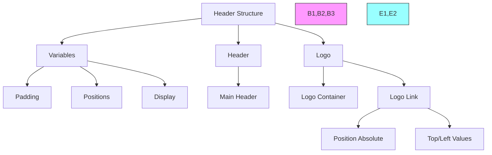

**Points de vérification**:

1. Variables:
   - ✓ Padding d'en-tête défini
   - ✓ Positions logo configurées
   - ✓ Display types spécifiés

2. Structure:
   - ✓ Position relative du conteneur
   - ✓ Position absolue du logo
   - ✓ Padding correct
   - ✓ Alignement précis

**Structure détaillée du code**:
```css
/* 1. Variables Root */
:root {
    --header-padding: 4rem 0 0;
    --header-logo-position: relative;
    --header-logo-link-display: inline-block;
    --header-logo-link-position: absolute;
    --header-logo-link-top: -1rem;
    --header-logo-link-left: 0;
}

/* 2. Header Styles */
.header {
    padding: var(--header-padding);
}

/* 3. Logo Container */
.header-logo {
    position: var(--header-logo-position);
}

/* 4. Logo Link */
.header-logo a {
    display: var(--header-logo-link-display);
    position: var(--header-logo-link-position);
    top: var(--header-logo-link-top);
    left: var(--header-logo-link-left);
}
```

**Explications techniques**:

1. **Positionnement Header**:
```css
.header {
    padding: 4rem 0 0; /* Espace en haut uniquement */
}
```

2. **Positionnement Logo**:
```css
.header-logo {
    position: relative; /* Crée un contexte de positionnement */
}

.header-logo a {
    position: absolute; /* Position par rapport au parent */
    top: -1rem;        /* Décalage négatif vers le haut */
    left: 0;           /* Aligné à gauche */
}
```

**Avantages de cette approche**:
1. Flexibilité de positionnement
2. Maintenance facilitée avec variables
3. Structure claire et organisée
4. Responsive-ready

# TASK 29: Styling et Propriétés Personnalisées pour la Navigation

**Question**: Comment créer des effets de survol personnalisés pour la navigation ?

```css
/* 1. Modification de la couleur au survol */
.nav-item-link-hover {
    color: var(--color-white);
}

/* 2. Style des éléments de navigation */
.nav .nav-link::before {
    content: '';
    position: absolute;
    top: 0;
    left: 0;
    background-color: var(--color-white);
    width: 0;
    height: 20%;
}

/* 3. Effet de survol */
.nav .nav-item:hover .nav-link::before {
    background-color: var(--color-primary);
    width: 100%;
}
```

```mermaid
graph TD
    A[Navigation Hover] --> B[État Initial]
    A --> C[État Survol]
    A --> D[Animation]
    
    B --> B1[Pseudo-élément]
    B --> B2[Position]
    B --> B3[Dimensions]
    
    C --> C1[Couleur]
    C --> C2[Largeur]
    
    D --> D1[Transition]

    style B1,B2,B3 fill:#f9f,stroke:#333
    style C1,C2 fill:#9ff,stroke:#333
    style D1 fill:#ff9,stroke:#333

```

**Points de vérification**:

1. Pseudo-élément:
   - ✓ Content vide défini
   - ✓ Position absolue
   - ✓ Dimensions initiales
   - ✓ Couleur de fond

2. Effet de survol:
   - ✓ Changement de couleur
   - ✓ Expansion largeur
   - ✓ Animation fluide

**Structure complète**:
```css
/* 1. Variables de navigation */
:root {
    --nav-item-link-hover: var(--color-white);
}

/* 2. Élément avant le lien */
.nav .nav-link::before {
    content: '';
    position: absolute;
    top: 0;
    left: 0;
    background-color: var(--color-white);
    width: 0;
    height: 20%;
}

/* 3. Effet de survol */
.nav .nav-item:hover .nav-link::before {
    background-color: var(--color-primary);
    width: 100%;
}

/* 4. Transition */
.nav .nav-link {
    position: relative;
    transition: var(--transition-duration) var(--transition-cubic-bezier);
}
```

**Explications techniques**:

1. **Pseudo-élément initial**:
```css
.nav-link::before {
    content: '';        /* Élément vide */
    position: absolute; /* Positionnement absolu */
    width: 0;          /* Largeur initiale nulle */
    height: 20%;       /* Hauteur partielle */
}
```

2. **Animation au survol**:
```css
.nav-item:hover .nav-link::before {
    width: 100%;      /* Extension complète */
    background-color: var(--color-primary); /* Nouvelle couleur */
}
```

**Avantages**:
1. Animation fluide
2. Effet visuel moderne
3. Feedback utilisateur clair
4. Maintenance facile

# TASK 30: Fix de la Section Works

**Question**: Comment structurer et animer la section des travaux avec des effets de survol ?

```css
/* 1. Style de base */
.card-outer {
    position: relative;
    overflow: hidden;
}

/* 2. Style de l'image */
.card-image img {
    height: 30rem;
    width: 100%;
    object-fit: cover;
    vertical-align: bottom;
}

/* 3. Style de l'intérieur de la carte */
.card-inner {
    position: absolute;
    top: -0.1rem;
    left: -0.1rem;
    right: -0.1rem;
    z-index: 1;
}

/* 4. Effet de survol */
.card-work:hover .card-inner {
    background-color: rgba(0, 0, 0, 0.7);
}

/* 5. Style du titre */
.card-title {
    text-align: center;
    margin: 0;
    opacity: 0;
    height: 100%;
    position: relative;
}

/* 6. Effet de survol sur le titre */
.card-work:hover .card-title {
    opacity: 1;
}
```

```mermaid
graph TD
    A[Card Work] --> B[Outer Container]
    A --> C[Image]
    A --> D[Inner Content]
    
    B --> B1[Position Relative]
    B --> B2[Hidden Overflow]
    
    C --> C1[Height Fixed]
    C --> C2[Full Width]
    C --> C3[Object Fit]
    
    D --> D1[Absolute Position]
    D --> D2[Z-Index]
    D --> D3[Hover Effect]

    style B1,B2 fill:#f9f,stroke:#333
    style C1,C2,C3 fill:#9ff,stroke:#333
    style D1,D2,D3 fill:#ff9,stroke:#333

```

**Points de vérification**:

1. Structure de base:
   - ✓ Conteneur externe positionné
   - ✓ Gestion du débordement
   - ✓ Images responsives

2. Effets de survol:
   - ✓ Overlay sombre
   - ✓ Apparition du titre
   - ✓ Transitions fluides

**Structure détaillée**:
```css
/* 1. Container externe */
.card-outer {
    position: relative;
    overflow: hidden;
}

/* 2. Gestion des images */
.card-image img {
    height: 30rem;
    width: 100%;
    object-fit: cover;
    vertical-align: bottom;
}

/* 3. Container interne */
.card-inner {
    position: absolute;
    top: -0.1rem;
    left: -0.1rem;
    right: -0.1rem;
    z-index: 1;
}

/* 4. Effets de survol */
.card-work:hover .card-inner {
    background-color: rgba(0, 0, 0, 0.7);
}

.card-title {
    text-align: center;
    margin: 0;
    opacity: 0;
    height: 100%;
    position: relative;
}

/* 5. Animation du titre */
.card-work:hover .card-title {
    opacity: 1;
}

/* 6. Liens dans le titre */
.card-title a {
    display: block;
    text-decoration: none;
    padding-top: 45%;
}

.card-title a::after {
    content: '';
    position: absolute;
    top: 0;
    left: 0;
    right: 0;
    bottom: 0;
}
```

**Explications techniques**:

1. **Gestion de l'image**:
```css
.card-image img {
    object-fit: cover;       /* Couvre tout l'espace */
    vertical-align: bottom;  /* Évite l'espace blanc */
}
```

2. **Overlay au survol**:
```css
.card-inner {
    position: absolute;     /* Positionnement absolu */
    /* Débordement négatif pour éviter les gaps */
    top: -0.1rem;
    left: -0.1rem;
    right: -0.1rem;
}
```

**Avantages**:
1. Structure propre
2. Effets visuels attrayants
3. Interface interactive
4. Responsive

