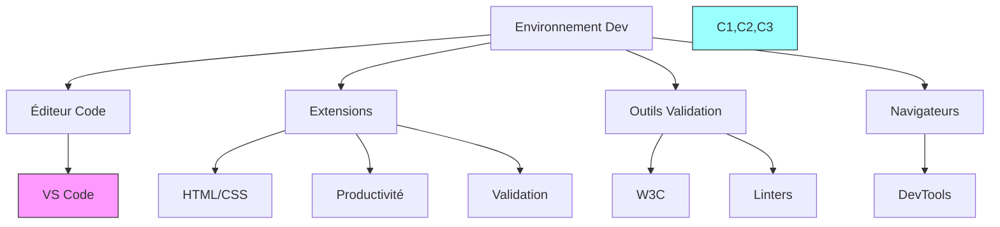
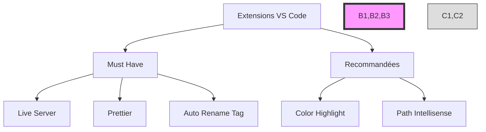

# Configuration de l'Environnement de Développement



## 1. Visual Studio Code - Extensions Essentielles

### HTML/CSS
```plaintext
1. Live Server
   - ID: ritwickdey.LiveServer
   - Auto-refresh du navigateur

2. HTML CSS Support
   - ID: ecmel.vscode-html-css
   - Autocomplétion

3. IntelliSense for CSS
   - ID: Zignd.html-css-class-completion
   - Suggestions classes

4. CSS Peek
   - ID: pranaygp.vscode-css-peek
   - Navigation rapide CSS
```

### Validation et Formatage
```plaintext
1. W3C Validation
   - ID: mrmlnc.vscode-html-css-less-formatter
   - Validation en temps réel

2. Prettier
   - ID: esbenp.prettier-vscode
   - Formatage automatique

3. ESLint
   - ID: dbaeumer.vscode-eslint
   - Détection erreurs
```

## 2. Configuration W3C Validator

### En ligne:
1. Pour HTML: https://validator.w3.org/
2. Pour CSS: https://jigsaw.w3.org/css-validator/

### Installation locale:
```bash
# Installation du validateur HTML
npm install -g html-validator-cli

# Installation du validateur CSS
npm install -g css-validator
```

### Configuration VS Code pour W3C:
```json
{
    "html.validate.scripts": true,
    "html.validate.styles": true,
    "css.validate": true,
    "editor.formatOnSave": true
}
```

## 3. DevTools des Navigateurs

### Chrome DevTools:
- Ouvrir: F12 ou Ctrl+Shift+I
- Extensions recommandées:
  1. Web Developer Tools
  2. ColorZilla
  3. PerfectPixel

### Firefox Developer Edition:
- Outils spécialisés pour CSS Grid
- Inspecteur Flexbox amélioré

## 4. Configuration Git et GitHub

```bash
# Configuration Git
git config --global user.name "Votre Nom"
git config --global user.email "votre@email.com"

# Fichier .gitignore
node_modules/
.vscode/
.DS_Store
```

## 5. Scripts utiles pour le workflow

```json
// package.json
{
  "scripts": {
    "validate:html": "html-validator --file=*.html",
    "validate:css": "css-validator styles/",
    "watch:sass": "sass --watch scss:css",
    "dev": "live-server"
  }
}
```

## 6. Structure de projet recommandée:

```plaintext
projet/
├── index.html
├── styles/
│   ├── normalize.css
│   ├── styles.css
│   └── variables.css
├── scripts/
├── images/
├── .gitignore
├── README.md
└── package.json
```

## 7. Commandes VS Code utiles:

- `Ctrl + Shift + P`: Palette de commandes
- `Alt + Z`: Word wrap
- `Ctrl + Space`: Suggestions
- `Ctrl + /`: Commenter/décommenter
- `Alt + ↑/↓`: Déplacer une ligne
- `Shift + Alt + F`: Formater le document

# Suite des Outils Essentiels et Configuration

## 8. Extensions VS Code Essentielles Prioritaires

```plaintext
MUST HAVE (Indispensables):
1. Live Server (Indispensable pour le développement web)
2. Prettier (Formatage automatique)
3. Auto Rename Tag (Modification automatique des balises)
4. IntelliSense for CSS (Suggestions CSS)
5. HTML CSS Support (Support basique HTML/CSS)
```



## 9. Configuration Prettier (Essentiel)

```json
// settings.json
{
    "editor.defaultFormatter": "esbenp.prettier-vscode",
    "editor.formatOnSave": true,
    "prettier.tabWidth": 2,
    "prettier.useTabs": false,
    "prettier.semi": true
}
```

## 10. Raccourcis Clavier Essentiels VS Code

```plaintext
INDISPENSABLES:
- Ctrl + S : Sauvegarder
- Ctrl + Space : Suggestions de code
- Alt + ↑/↓ : Déplacer une ligne
- Ctrl + / : Commenter/décommenter
- F1 ou Ctrl + Shift + P : Palette de commandes
```

## 11. Structure Minimale de Projet

```plaintext
projet/
├── index.html          # Page principale
├── styles/
│   └── style.css      # CSS unique
├── images/            # Images du projet
└── README.md          # Documentation
```

## 12. Validation W3C Simplifiée

1. Méthode en ligne (la plus simple):
   - HTML: https://validator.w3.org/#validate_by_input
   - CSS: https://jigsaw.w3.org/css-validator/#validate_by_input

2. Extension VS Code:
   ```json
   {
       "html.validate.scripts": true,
       "css.validate": true
   }
   ```

## 13. DevTools Navigation (Essentiel)

```plaintext
Chrome DevTools (F12):
- Elements : Inspection HTML/CSS
- Console : Débogage
- Sources : Fichiers sources
```

## 14. Tips pour un Développement Efficace

1. Toujours avoir :
   - Live Server actif
   - DevTools ouvert
   - W3C Validator accessible

2. Pratiques recommandées :
   - Sauvegarder fréquemment
   - Valider régulièrement le code
   - Commenter les sections importantes
   - Utiliser des noms de classes explicites

## 15. Modèle HTML de Base

```html
<!DOCTYPE html>
<html lang="fr">
<head>
    <meta charset="UTF-8">
    <meta name="viewport" content="width=device-width, initial-scale=1.0">
    <title>Titre</title>
    <link rel="stylesheet" href="styles/style.css">
</head>
<body>
    <!-- Contenu -->
</body>
</html>
```
